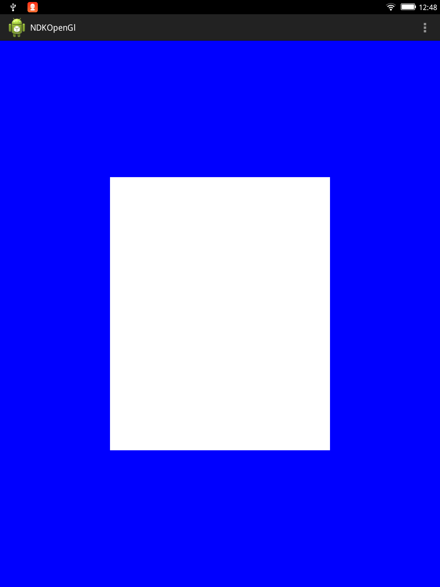

####Android的NDK开发(2)-基于NDK的OpenGL开发
转载:
http://blog.csdn.net/silangquan/article/details/8496454

  之前在学习Android的时候有写过如果在[Android中使用OpenGL](http://blog.csdn.net/qp120291570/article/details/7938332),当时完全都是用java语言来实现的，现在我们用NDK来实现一次。
     实现的思路就是将渲染器中的onDrawFrame，onSurfaceChanged，onSurfaceCreated分别在C中实现，然后将C编译成.so文件之后在Java中直接调用相应的函数就可以了。
     步骤就不详细叙述了，代码贴一下。
    主Activity：
```
package com.empty.ndkgl;  
  
import com.example.ndkgl.R;  
  
import android.opengl.GLSurfaceView;  
import android.os.Bundle;  
import android.app.Activity;  
import android.view.Menu;  
  
public class NdkGlActivity extends Activity {  
  
    @Override  
    protected void onCreate(Bundle savedInstanceState) {  
        super.onCreate(savedInstanceState);  
        GLSurfaceView surface = new GLSurfaceView(this);    
        surface.setRenderer(new NdkGlRender());    
        setContentView(surface);   
    }  
    static {    
        //load library     
        System.loadLibrary("NdkGLRenderer");    
   }    
    @Override  
    public boolean onCreateOptionsMenu(Menu menu) {  
        // Inflate the menu; this adds items to the action bar if it is present.  
        getMenuInflater().inflate(R.menu.activity_ndkgl, menu);  
        return true;  
    }  
  
}  
```
**Render类代码：**
```
[java] view plaincopy
package com.empty.ndkgl;  
  
import javax.microedition.khronos.egl.EGLConfig;  
import javax.microedition.khronos.opengles.GL10;  
  
import android.opengl.GLSurfaceView.Renderer;  
  
public class NdkGlRender implements Renderer{  
  
    //declare native function  
     native private void onNdkSurfaceCreated ();    
     native private void onNdkSurfaceChanged (int width, int height);    
     native private void onNdkDrawFrame();  
    @Override  
    public void onDrawFrame(GL10 arg0) {  
        // TODO Auto-generated method stub  
        onNdkDrawFrame ();   
    }  
  
    @Override  
    public void onSurfaceChanged(GL10 gl, int width, int height) {  
        // TODO Auto-generated method stub  
        onNdkSurfaceChanged (width, height);  
    }  
  
    @Override  
    public void onSurfaceCreated(GL10 gl, EGLConfig config) {  
        // TODO Auto-generated method stub  
        onNdkSurfaceCreated ();  
    }  
      
}  
```
在工程目录下创建jni文件夹，用下面的命令生成.h文件。
```
[plain] view plaincopy
javah -classpath bin/classes -d jni com.empty.ndkgl.NdkGlRender  
```
根据头文件来创建.c文件。
注：虽然生产的 .h文件在编译的时候并没有什么作用，但还是建议做这一步，因为.c文件中的函数名一定要和.h文件中的函数名一致，最后的程序才能正常运行，不然会出现如
**java.lang.UnsatisfiedLinkError的bug。**
```
[cpp] view plaincopy
#include <jni.h>  
#include <GLES/gl.h>  
unsigned int vbo[2];  
float positions[12] = {1,-1,0, 1,1,0, -1,-1,0, -1,1,0};  
short indices  [4]  = {0,1,2,3};  
JNIEXPORT void JNICALL Java_com_empty_ndkgl_NdkGlRender_onNdkSurfaceCreated (JNIEnv* env, jobject obj)  
{  
    //生成两个缓存区对象  
    glGenBuffers (2, vbo);  
    //绑定第一个缓存对象  
    glBindBuffer (GL_ARRAY_BUFFER, vbo[0]);  
    //创建和初始化第一个缓存区对象的数据  
    glBufferData (GL_ARRAY_BUFFER, 4*12, positions, GL_STATIC_DRAW);  
    //绑定第二个缓存对象  
    glBindBuffer (GL_ELEMENT_ARRAY_BUFFER, vbo[1]);  
    //创建和初始化第二个缓存区对象的数据  
    glBufferData (GL_ELEMENT_ARRAY_BUFFER, 2*4, indices, GL_STATIC_DRAW);  
}  
JNIEXPORT void JNICALL Java_com_empty_ndkgl_NdkGlRender_onNdkSurfaceChanged(JNIEnv* env, jobject obj, jint width, jint height)  
{  
    //图形最终显示到屏幕的区域的位置、长和宽  
    glViewport (0,0,width,height);  
    //指定矩阵  
    glMatrixMode   (GL_PROJECTION);  
    //将当前的矩阵设置为glMatrixMode指定的矩阵  
    glLoadIdentity ();  
    glOrthof(-2, 2, -2, 2, -2, 2);  
}  
  
JNIEXPORT void JNICALL Java_com_empty_ndkgl_NdkGlRender_onNdkDrawFrame (JNIEnv* env, jobject obj)  
{  
    //启用顶点设置功能，之后必须要关闭功能  
    glEnableClientState (GL_VERTEX_ARRAY);  
    //清屏  
    glClearColor (0,0,1,1);  
    glClear (GL_COLOR_BUFFER_BIT | GL_DEPTH_BUFFER_BIT);  
    glMatrixMode (GL_MODELVIEW);  
    glLoadIdentity ();  
    glBindBuffer    (GL_ARRAY_BUFFER, vbo[0]);  
    //定义顶点坐标  
    glVertexPointer (3, GL_FLOAT, 0, 0);  
    glBindBuffer    (GL_ELEMENT_ARRAY_BUFFER, vbo[1]);  
    //按照参数给定的值绘制图形  
    glDrawElements  (GL_TRIANGLE_STRIP, 4, GL_UNSIGNED_SHORT, 0);  
    //关闭顶点设置功能  
    glDisableClientState(GL_VERTEX_ARRAY);  
}  
```
**编写Android.mk**
```
[plain] view plaincopy
#FileName:Android.mk  
#Description:makefile of NdkGl  
LOCAL_PATH := $(call my-dir)  
  
include $(CLEAR_VARS)  
  
LOCAL_MODULE    := NdkGLRenderer  
LOCAL_SRC_FILES := com_empty_ndkgl_NdkGlRender.c  
   
LOCAL_LDLIBS := -lGLESv1_CM  
  
include $(BUILD_SHARED_LIBRARY)  
```
编译库

**$NDK_ROOT/ndk-build**  

这个不会的 到上一篇看 怎么使用NDK编译

在Eclipse中运行程序

