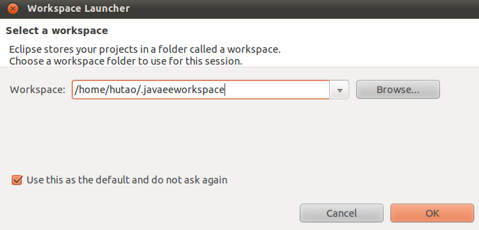
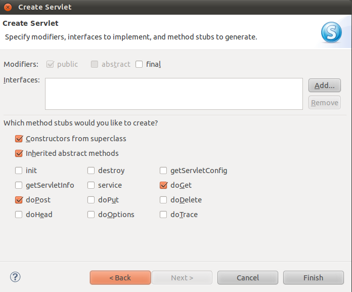

###Ubuntu下搭建JavaEE开发环境
原文地址：http://blog.csdn.net/htttw/article/details/7596232

JavaEE是一个非常优秀的Web框架，包含了JSP，Servlet等，今天我们介绍如何在Ubuntu下搭建JavaEE开发环境：


1.
在http://www.eclipse.org/downloads/?osType=linux下载Eclipse IDE for Java EE，其中集成了包含Java EE插件的Eclipse IDE，我的版本是Eclipse Indigo，大概211M左右


2.
解压，直接就是一个文件夹，运行其中的eclipse即可。当然也可以创建一个桌面启动器，和Windows中的快捷方式是一样的。可以把这个文件夹放在任何地方。像本人先前已经安装了Eclipse IDE for Java SE，但这两个不会冲突。

如下图：


3.
现在我们需要一个Web服务器，当然首选就是Tomcat：
在http://tomcat.apache.org/下载Tomcat的已经编译好的映像文件，我的是Tomcat 7.0.27 Released


4.
解压Tomcat到任何一个目录，这样Tomcat就安装好了


5.
下面我们新建一个Web项目来测试：
打开Eclipse，自动弹出对话框，设置workspace路径：
如下图：



6
选择File-->New-->Dynamic Web Project
在弹出的对话框中输入Project Name，这里输入HelloWorld
在Target runtime中设置我们的Tomcat服务器，具体方法是：
点击右侧的New Runtime...按钮，选择Apache Tomcat v7.0
如图


点击Next，在Tomcat installation direction中填入我们的Tomcat所在目录，然后点击Finish

设置完成后如下图所示：


7.
点击Next，设置源文件目录，这里保持默认，再点击Next，这里是设置根目录的，我们也保持默认，不过需要勾选"生成web.xml"，这样项目会自动帮我们创建web.xml（当然，也可以之后手动创建，效果是一样的），如下图所示：


点击Finish即可


8.
在Eclipse下方的Servers选项卡中点击"new server wizard"，如下图：

点击Next按钮，将左侧的HelloWorld添加到右侧，如下图所示（这一步很重要，不能忘记!!!）：


如果已经执行过"new server wizard"了，只需右键选择"Add and Remove..."即可


点击Finish即可

9.
在Server选项卡中会新出现一项"Tomcat v7.0 Server"，右键它，选择Start，这样Tomcat服务器就启动起来了，如下图：

在Console选项卡中输出的信息如下：


10.
下面我们新建一个JSP文件：
在Project Explorer的Web Content右键选择New-->JSP File，输入test.jsp
点击Next，保持默认的"New JSP File(html)"，点击Finish即可


11.
在test.jsp中输入以下内容：
```javascrip
test.jsp

[html] view plaincopy
<%@ page language="java" contentType="text/html; charset=UTF-8"  
    pageEncoding="UTF-8"%>  
<!DOCTYPE html PUBLIC "-//W3C//DTD HTML 4.01 Transitional//EN" "http://www.w3.org/TR/html4/loose.dtd">  
<html>  
<head>  
<meta http-equiv="Content-Type" content="text/html; charset=UTF-8">  
<title>Insert title here</title>  
</head>  
<body>  
<%  
  out.println("1 + 1 = " + (1 + 1));  
%>  
</body>  
</html> 
```
12.
在浏览器中输入http://localhost:8080/HelloWorld/test.jsp，如下所示，说明一切正常。


上面只是一个简单的JSP文件，下面我们新建一个Servlet来测试：

-----------------------

####Servlet  Hello
1.
在HelloWorld的Web Content右键选择New-->Other-->Web-->Servlet，按下图设置：


2.
点击Next，保持默认，再点击Next，主要是设置一些方法的，也保持默认，点击Finish，如下所示：


3.
修改Hello.java的doGet和doPost方法如下：

```
Hello.java
[java] view plaincopy
package com.test.firstweb.hello;  
  
import java.io.IOException;  
import java.io.PrintWriter;  
  
import javax.servlet.ServletException;  
import javax.servlet.annotation.WebServlet;  
import javax.servlet.http.HttpServlet;  
import javax.servlet.http.HttpServletRequest;  
import javax.servlet.http.HttpServletResponse;  
  
/** 
 * Servlet implementation class Hello 
 */  
@WebServlet("/Hello")  
public class Hello extends HttpServlet {  
    private static final long serialVersionUID = 1L;  
         
    /** 
     * @see HttpServlet#HttpServlet() 
     */  
    public Hello() {  
        super();  
        // TODO Auto-generated constructor stub  
    }  
  
    /** 
     * @see HttpServlet#doGet(HttpServletRequest request, HttpServletResponse response) 
     */  
    protected void doGet(HttpServletRequest request, HttpServletResponse response) throws ServletException, IOException {  
        // TODO Auto-generated method stub  
        request.setCharacterEncoding("UTF-8");  
        response.setCharacterEncoding("UTF-8");  
        response.setContentType("text/html");  
          
        PrintWriter out = response.getWriter();  
          
        /* 输出到客户端 */  
        out.println("<html>");  
        out.println("<head><title>Servlet test</title></head>");  
        out.println("<body>");  
        out.println("<form action = '" + request.getRequestURI() + "' method = 'post'>");  
        out.println("请输入您的名字：<input type = 'text' name = 'name' />");  
        out.println("<input type = 'submit' />");  
        out.println("</form>");  
          
        String name = request.getParameter("name");  
          
        if( (name != null) && (name.trim().length() > 0) )  
        {  
            out.println("您好， <b>" + name + "</b>. 欢迎来到Java Web世界！");  
        }  
          
        out.println("</body>");  
        out.println("</html>");         
    }  
  
    /** 
     * @see HttpServlet#doPost(HttpServletRequest request, HttpServletResponse response) 
     */  
    protected void doPost(HttpServletRequest request, HttpServletResponse response) throws ServletException, IOException {  
        // TODO Auto-generated method stub  
        doGet(request, response);  
    }  
  
}  
```


4.
Servlet创建好了，但此时无法找到这个Servlet，因为我们需要在web.xml中声明该Servlet：
其中`<servlet-name>`是这个Servlet的类名，
`<servlet-class>`是这个Servlet所在的完整包名和类名，也就是我们之前创建Servlet时在Java package中输入的内容后加类名`<url-patter>`是任意的，比如为/servlet/Hello，则在浏览器中输入http://localhost:8080/HelloWorld/servlet/Hello会访问到这个Servlet
```
web.xml：

[plain] view plaincopy
<?xml version="1.0" encoding="UTF-8"?>  
<web-app xmlns:xsi="http://www.w3.org/2001/XMLSchema-instance" xmlns="http://java.sun.com/xml/ns/javaee" xmlns:web="http://java.sun.com/xml/ns/javaee/web-app_2_5.xsd" xsi:schemaLocation="http://java.sun.com/xml/ns/javaee http://java.sun.com/xml/ns/javaee/web-app_3_0.xsd" id="WebApp_ID" version="3.0">  
  <display-name>HelloWorld</display-name>  
  <welcome-file-list>  
    <welcome-file>index.html</welcome-file>  
    <welcome-file>index.htm</welcome-file>  
    <welcome-file>index.jsp</welcome-file>  
    <welcome-file>default.html</welcome-file>  
    <welcome-file>default.htm</welcome-file>  
    <welcome-file>default.jsp</welcome-file>  
  </welcome-file-list>  
  
  <servlet>  
    <servlet-name>Hello</servlet-name>  
    <servlet-class>com.test.firstweb.hello.Hello</servlet-class>  
  </servlet>  
    
  <servlet-mapping>  
    <servlet-name>Hello</servlet-name>  
    <url-pattern>/servlet/Hello</url-pattern>  
  </servlet-mapping>  
  
</web-app>  

```


5.
重启Tomcat服务器（任何修改了web.xml后都必须重启服务器）


6.
在浏览器中输入http://localhost:8080/HelloWorld/servlet/Hello
如下所示：


至此，我们的JavaEE开发环境搭建完毕！


