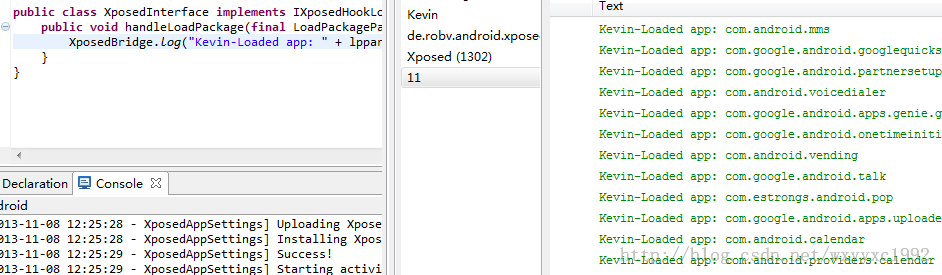

##Xposed Developer Wiki

###3.1 创建一个Xposed Module


一个XposedModule本质上是设定了部分特殊元数据标志位的普通应用程序，需要在AndroidManifest.xml文件中添加如下设置： 
 **AndroidManifest.xml => Application => Application Nodes (at the bottom) => Add => Meta Data** 
添加节点：**name = xposedmodule，value = true。name = xposedminiversion, value = API level。**
```
<?xml version="1.0" encoding="utf-8"?> 
<manifest xmlns:android="http://schemas.android.com/apk/res/android" 
    package="de.robv.android.xposed.mods.tutorial" 
    android:versionCode="1" 
    android:versionName="1.0" > 
    <uses-sdk android:minSdkVersion="15" /> 
    <application 
        android:icon="@drawable/ic_launcher" 
        android:label="@string/app_name" > 
        <meta-data android:value="true" android:name="xposedmodule"/> 
        <meta-data android:value="2.0*" android:name="xposedminversion"/> 
        <meta-data android:value="Demonstration of the Xposed framework.\nMakes the status bar clock red." android:name="xposeddescription"/> 
    </application> 
</manifest> 
```
然后，将XposedBridge.jar这个引用导入到工程中，加入到reference path中。 
下面开始创建一个新的工程： 
```
package com.kevin.myxposed; 
import android.util.Log; 
import de.robv.android.xposed.IXposedHookLoadPackage; 
import de.robv.android.xposed.XposedBridge; 
import de.robv.android.xposed.callbacks.XC_LoadPackage.LoadPackageParam; 
public class XposedInterface implements IXposedHookLoadPackage { 
public void handleLoadPackage(final LoadPackageParam lpparam) throws Throwable { 
        XposedBridge.log("Kevin-Loaded app: " + lpparam.packageName); 
    } 
} 
```
然后在assets目录下新建一个xposed_init文件，这个文件声明了需要加载到XposedInstaller的入口类： 

```
com.kevin.myxposed.XposedInterface 
```

运行程序并在XposedInstaller的Module选项中激活，重启机器后可以得到如下数据： 
  


###3.2 HookedMethod：定位你要hook的方法


在上一步中我们已经定位了需要Hook的方法以及所在的类，譬如： 
**com.android.systemui.statusbar.policy.Clock** 类 
中的updateClock方法。 

```
package de.robv.android.xposed.mods.tutorial; 
import static de.robv.android.xposed.XposedHelpers.findAndHookMethod; 
import de.robv.android.xposed.IXposedHookLoadPackage; 
import de.robv.android.xposed.XC_MethodHook; 
import de.robv.android.xposed.callbacks.XC_LoadPackage.LoadPackageParam; 
public class Tutorial implements IXposedHookLoadPackage { 
    public void handleLoadPackage(final LoadPackageParam lpparam) throws Throwable { 
     if (!lpparam.packageName.equals("com.android.systemui")) 
            return; 
     
     findAndHookMethod("com.android.systemui.statusbar.policy.Clock", lpparam.classLoader, "handleUpdateClock", new XC_MethodHook() { 
     @Override 
     protected void beforeHookedMethod(MethodHookParam param) throws Throwable { 
     // this will be called before the clock was updated by the original method 
     } 
     @Override 
     protected void afterHookedMethod(MethodHookParam param) throws Throwable { 
     // this will be called after the clock was updated by the original method 
     } 
}); 
    } 
} 
```

关于findAndHookMethod方法的说明见下面的API Reference。
###3.3 进行资源替换

####3.3.1 简易资源替换


下面所使用的方法可以适用于`Boolean、Color、Integer、int[]、String与String[]`。 
其中，对于Android框架层的资源（所有的APP都需要调用的资源）应该在initZygote这个方法中完成替换。而对于属于应用程序的资源，应该在**hookInitPackageResources**这个方法中完成替换。 

```
@Override 
public void initZygote(IXposedHookZygoteInit.StartupParam startupParam) throws Throwable { 
XResources.setSystemWideReplacement("android", "bool", "config_unplugTurnsOnScreen", false); 
} 
@Override 
public void handleInitPackageResources(InitPackageResourcesParam resparam) throws Throwable { 
// replacements only for SystemUI 
if (!resparam.packageName.equals("com.android.systemui")) 
return; 
// different ways to specify the resources to be replaced 
resparam.res.setReplacement(0x7f080083, "YEAH!"); // WLAN toggle text. You should not do this because the id is not fixed. Only for framework resources, you could use android.R.string.something 
resparam.res.setReplacement("com.android.systemui:string/quickpanel_bluetooth_text", "WOO!"); 
resparam.res.setReplacement("com.android.systemui", "string", "quickpanel_gps_text", "HOO!"); 
resparam.res.setReplacement("com.android.systemui", "integer", "config_maxLevelOfSignalStrengthIndicator", 6); 
　　resparam.res.setReplacement("com.android.systemui",  
　　                    "drawable", "status_bar_background",  
　　    new XResources.DrawableLoader() { 
　　 @Override 
　　 public Drawable newDrawable(XResources res, int id) throws Throwable { 
　　 return new ColorDrawable(Color.WHITE); 
　　 } 
　　}); 
}
```

####3.3.2 复杂资源


```
package de.robv.android.xposed.mods.coloredcirclebattery; 
import android.content.res.XModuleResources; 
import de.robv.android.xposed.IXposedHookInitPackageResources; 
import de.robv.android.xposed.IXposedHookZygoteInit; 
import de.robv.android.xposed.callbacks.XC_InitPackageResources.InitPackageResourcesParam; 
public class ColoredCircleBattery implements IXposedHookZygoteInit, IXposedHookInitPackageResources { 
private static String MODULE_PATH = null; 
@Override 
public void initZygote(StartupParam startupParam) throws Throwable { 
MODULE_PATH = startupParam.modulePath; 
} 
@Override 
public void handleInitPackageResources(InitPackageResourcesParam resparam) throws Throwable { 
if (!resparam.packageName.equals("com.android.systemui")) 
return; 
XModuleResources modRes = XModuleResources.createInstance(MODULE_PATH, resparam.res); 
resparam.res.setReplacement("com.android.systemui", "drawable", "stat_sys_battery", modRes.fwd(R.drawable.battery_icon)); 
resparam.res.setReplacement("com.android.systemui", "drawable", "stat_sys_battery_charge", modRes.fwd(R.drawable.battery_icon_charge)); 
} 
}
```

####3.3.3 修改layouts


```
@Override 
public void handleInitPackageResources(InitPackageResourcesParam resparam) throws Throwable { 
if (!resparam.packageName.equals("com.android.systemui")) 
return; 
resparam.res.hookLayout("com.android.systemui", "layout", "status_bar", new XC_LayoutInflated() { 
@Override 
public void handleLayoutInflated(LayoutInflatedParam liparam) throws Throwable { 
TextView clock = (TextView) liparam.view.findViewById( 
liparam.res.getIdentifier("clock", "id", "com.android.systemui")); 
clock.setTextColor(Color.RED); 
} 
});  
}
```

###4 API Reference

####4.1.关键类/API说明

**IXposedHookLoadPackage**


- Method ：handleLoadPackage

- 调用示例 

```
public class XposedInterface implements IXposedHookLoadPackage { 
public void handleLoadPackage(final LoadPackageParam lpparam) throws Throwable { 
        XposedBridge.log("Kevin-Loaded app: " + lpparam.packageName); 
    } 
} 
```

- 参数说明 
 final LoadPackageParam lpparam这个参数包含了加载的应用程序的一些基本信息。
 
**XposedHelpers**


- Method :findAndHookMethod

-  使用示例 
这是一个辅助方法，可以通过如下方式静态导入： 

```
import static de.robv.android.xposed.XposedHelpers.findAndHookMethod; 
```

```
findAndHookMethod("com.android.systemui.statusbar.policy.Clock", lpparam.classLoader, "handleUpdateClock", new XC_MethodHook() { 
     @Override 
     protected void beforeHookedMethod(MethodHookParam param) throws Throwable { 
     // this will be called before the clock was updated by the original method 
     } 
     @Override 
     protected void afterHookedMethod(MethodHookParam param) throws Throwable { 
     // this will be called after the clock was updated by the original method 
     } 
}); 
```

-  参数说明 


```
 findAndHookMethod(Class<?> clazz,   //需要Hook的类名 
      ClassLoader，   //类加载器，可以设置为null 
      String methodName,    //需要Hook的方法名 
      Object... parameterTypesAndCallback 
) 


该函数的最后一个参数集，包含了： 
（1）Hook的目标方法的参数,譬如： 
     "com.android.internal.policy.impl.PhoneWindow.DecorView" 
     是方法的参数的类。 
（2）回调方法： 
     a.XC_MethodHook  
     b.XC_MethodReplacement 
```

 


  
 
####4.2.辅助项API


Xposed框架也为我们提供了很多的辅助项来帮助我们快速开发XposedModule。
**XposedBridge 类**

- Method  : **log**

- Description : 该方法可以将log信息以及Throwable抛出的异常信息输出到标准的logcat以及/data/xposed/debug.log这个文件中。

- Method  :  hookAllMethods / hookAllConstructors

- Description : 该方法可以用来hook某个类中的所有方法或者构造函数，但是不同的Rom（非Android原生Rom）会有不同的变种。

 
**XposedHelpers 类**

>这个类用的也是比较多，可以使用 Window => Preferences => Java => Editor => Content Assist => Favorites => New Type, enter de.robv.android.xposed.XposedHelpers 
这种方式将XposedHelpers这个类加入到Eclipse静态调用中方便查阅。

- Method  :  findMethod / findConstructor / findField

- Description :  这是一组用于检索方法的方法。

- Method  :  callMethod / callStaticMethod / newInstance
- Method  :  assetAsByteArray

- Description : 以字节数组的形式返回asset，可以以如下方式调用： 
```
public class XposedTweakbox { 
private static final String MODULE_PATH = null;  
    // injected by XposedBridge 
public static void init(String startClassName) throws Exception { 
if (startClassName != null) 
return; 
Resources tweakboxRes = 
 XModuleResources.createInstance(MODULE_PATH, null); 
byte[] crtPatch = assetAsByteArray(tweakboxRes,  
"crtfix_samsung_d506192d5049a4042fb84c0265edfe42.bsdiff"); 
```

 

 

- Method  :  getMD5Sum

- Description :  返回对于一个文件的MD5校验值，需要root权限。

- Method  :  getProcessPid

- Description :  : 获取一个进程的PID值，输入参数为/proc/[pid]/cmdline

