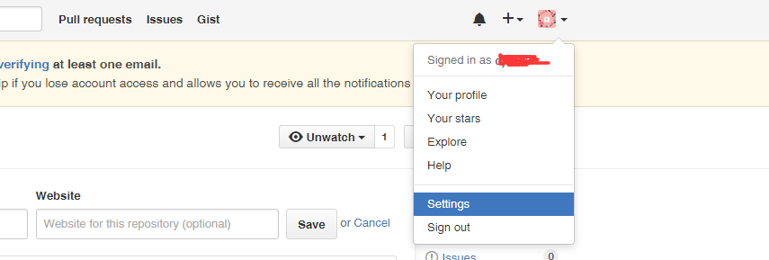

###gitHub基本使用
**1、注册github帐户** 
 登录http://github.com
 
**2、下载客户端 for windows**
连接 https://desktop.github.com/

**3、连接**
- 安装好后点击下列图标GUI登录   如果 本地已经有SSH密钥了 他会帮你在gitHub上注册好SSH  
>
  

- 入过没有的话 点击 shell 
>


- 输入
>
```
ssh-keygen -t rsa -C  your_email@youremail.com
``` 


- 在把输出的文件  注册到gitHub SSH上 找到帐号设置
>

- 在这里添加输入
>


- 测试是否成功
     在命令行输入：ssh -T git@github.com 如果成功，会显示欢迎字符。

**4、新建仓库**

 在网站上登录你的github帐户，点击Repositoies选项卡 填写个note
**5、建立本地库 与代码同步**
在自己电脑上任意一个文件夹，新建一个目录，目录名与在github上所建库的名字相同

输入：

```
git init
git remote add origin git@github.com:djh123/note.git

开始同步

git pull origin master

git add New.java  //添加单个

git add --all  //添加所有

git commit-m"提交“  //打标签

git push origin master //通知仓库更新
```


