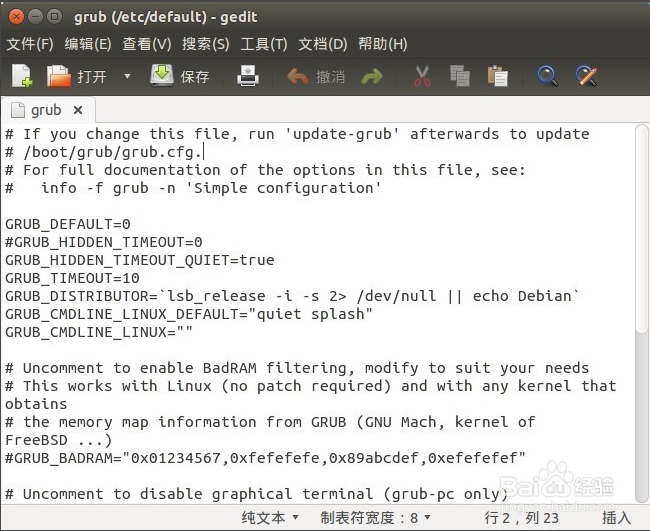
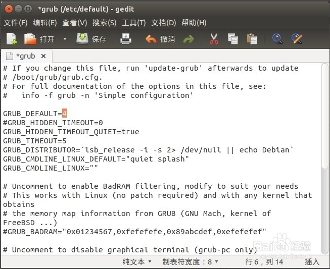

###win7与ubuntu14.04双系统下修改默认启动项

>在win7系统下硬盘安装完ubuntu14.04后，默认情况下的默认启动项是ubuntu14.04系统，对于许多习惯于win7的人来说每次都得选择一次比较麻烦，那么就可以通过ubuntu系统下修改grub配置文件改变默认启动项。

- 1在终端中输入：**sudo gedit /etc/default/grub**
其中gedit是指文本编辑器，然后输入密码，密码就是开机密码，注意这里输入密码后不会显示出来，直接输完密码回车就行。

    
    

- 2输入完回车后会弹出一个grub文件，将文本”GRUB_DEFAULT=0“中的0改成win7系统的序号4，同时可以修改”GRUB_TIMEOUT=10“中的10，修改默认的等待时间，这里改成5秒。改完后点击”保存“然后关闭。

- 3修改完成以后，别忘了最重要的一步，上面文本编辑器的保存只是将内容修改了，但并没有更新配置，还需要在终端输入：**sudo update-grub**
这步完成以后默认的启动项就修改完了，可以重启电脑试试。