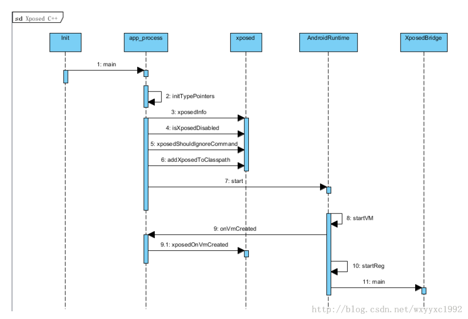
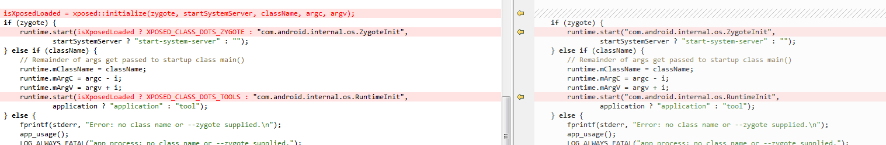
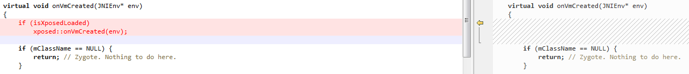

##xposed 框架学习

[TOC]
###一、xposed 启动过程
####1.app_main
看这篇最好看下**zygote启动分析**，其实很简单的，就是 xposed  对app_process 进行了修改加入了启动xposed的分支。个人觉得拿xposed的app_main.cpp和原来的app_main.cpp比较就很清楚。每次都代码文字啊分析啊什么的，这次借用下某位大婶的时序图


然后对比了下原来的和现在的app_main 我们 看下main函数，

看到没有就这么点区别，翻译过来就是如果xposed存在就加载xposed的main ，如果不存在就加载原来的main 。那我们看下de.robv.android.xposed.XposedBridge.main 

```
try {
			SELinuxHelper.initOnce();
			SELinuxHelper.initForProcess(null);

			runtime = getRuntime();
			if (initNative()) {
				XPOSED_BRIDGE_VERSION = getXposedVersion();
				if (isZygote) {
					startsSystemServer = startsSystemServer();
					initForZygote();
				}
				loadModules();
			} else {
				log("Errors during native Xposed initialization");
			}
		} catch (Throwable t) {
			log("Errors during Xposed initialization");
			log(t);
			disableHooks = true;
		}

		// Call the original startup code
		if (isZygote)
			ZygoteInit.main(args);
		else
			RuntimeInit.main(args);
```
这边又是个**if** 在**if**上面就是xposed多出来的代码 ，上面的代码就是初始化xposed 啊 什么的。然后xposed就启动了。至于怎么工作的后面第三章会讲到。 
####2.虚拟机 
在比较的时候还看到下图， 虚拟机被改掉了 onVmCreated  。这里加入了 xposed::OnVmCreate 这里买你大概进行了后面要用的本地函数的注册什么的 我没详细看。据说对后面5.0的art是很重要的什么的。



###二、hook流程分析

####1.findAndHookMethod
先看下常用的 函数
```
findAndHookMethod(ActivityThread.class, "handleBindApplication", "android.app.ActivityThread.AppBindData", new XC_MethodHook() {}
```
当时我就不乐意了 凭什么他这个可以 替换别人的方法，很想知道下是怎么做的。
然后就跟进去看下
```
public static XC_MethodHook.Unhook findAndHookMethod(Class<?> clazz, String methodName, Object... parameterTypesAndCallback) {
if (parameterTypesAndCallback.length == 0 || !(parameterTypesAndCallback[parameterTypesAndCallback.length-1] instanceof XC_MethodHook))
			throw new IllegalArgumentException("no callback defined");

XC_MethodHook callback = (XC_MethodHook) parameterTypesAndCallback[parameterTypesAndCallback.length-1];
Method m = findMethodExact(clazz, methodName, getParameterClasses(clazz.getClassLoader(), parameterTypesAndCallback));

return XposedBridge.hookMethod(m, callback);
}
```

####2.findMethodExact
我是菜鸟真没怎么看懂，大概意思说 通过这个**findMethodExact**方法 找到这个**clazz**的Method。怎么找？？？好吧在进入这个方法**findMethodExact**看看 
```
	public static Method findMethodExact(Class<?> clazz, String methodName, Class<?>... parameterTypes) {
		StringBuilder sb = new StringBuilder(clazz.getName());
		sb.append('#');
		sb.append(methodName);
		sb.append(getParametersString(parameterTypes));
		sb.append("#exact");
		String fullMethodName = sb.toString();

		if (methodCache.containsKey(fullMethodName)) {
			Method method = methodCache.get(fullMethodName);
			if (method == null)
				throw new NoSuchMethodError(fullMethodName);
			return method;
		}

		try {
			Method method = clazz.getDeclaredMethod(methodName, parameterTypes);
			method.setAccessible(true);
			methodCache.put(fullMethodName, method);
			return method;
		} catch (NoSuchMethodException e) {
			methodCache.put(fullMethodName, null);
			throw new NoSuchMethodError(fullMethodName);
		}
	}
```

我是不知道它讲什么，算了反正就找到了 这个method，OK？ 而且还把这个method 设置成了可见**method.setAccessible(true);**  是这个意思吗？

####3.hookMethod
我们回到**2**这边 看他最后 弄了个 这个 **XposedBridge.hookMethod(m, callback);**  我们跟进去看看
```
public static XC_MethodHook.Unhook hookMethod(Member hookMethod, XC_MethodHook callback) {
 if (!(hookMethod instanceof Method) && !(hookMethod instanceof Constructor<?>)) {
			throw new IllegalArgumentException("Only methods and constructors can be hooked: " +      hookMethod.toString());
} else if (hookMethod.getDeclaringClass().isInterface()) {
			throw new IllegalArgumentException("Cannot hook interfaces: " + hookMethod.toString());
		} else if (Modifier.isAbstract(hookMethod.getModifiers())) {
			throw new IllegalArgumentException("Cannot hook abstract methods: " + hookMethod.toString());
		}
	boolean newMethod = false;
	CopyOnWriteSortedSet<XC_MethodHook> callbacks;
	synchronized (sHookedMethodCallbacks) {
			callbacks = sHookedMethodCallbacks.get(hookMethod);
			if (callbacks == null) {
				callbacks = new CopyOnWriteSortedSet<XC_MethodHook>();
				sHookedMethodCallbacks.put(hookMethod, callbacks);
				newMethod = true;
			}
		}
		callbacks.add(callback);
		if (newMethod) {
			Class<?> declaringClass = hookMethod.getDeclaringClass();
			int slot = (runtime == RUNTIME_DALVIK) ? (int) getIntField(hookMethod, "slot") : 0;

			Class<?>[] parameterTypes;
			Class<?> returnType;
			if (hookMethod instanceof Method) {
				parameterTypes = ((Method) hookMethod).getParameterTypes();
				returnType = ((Method) hookMethod).getReturnType();
			} else {
				parameterTypes = ((Constructor<?>) hookMethod).getParameterTypes();
				returnType = null;
			}

			AdditionalHookInfo additionalInfo = new AdditionalHookInfo(callbacks, parameterTypes, returnType);
			hookMethodNative(hookMethod, declaringClass, slot, additionalInfo);
		}

		return callback.new Unhook(hookMethod);
	}
```

我靠这么多  这你能懂 。。。 让我们删除些没用的看看
```
AdditionalHookInfo additionalInfo = new AdditionalHookInfo(callbacks, parameterTypes, returnType);
hookMethodNative(hookMethod, declaringClass, slot, additionalInfo);
```
现在好了 它把所有的 信息弄成了个 **additionalInfo** 和**hookMethod** 传下去了 
#####3.1.**hookMethodNative** 
那就看看他咯
```
private native synchronized static void hookMethodNative(Member method, Class<?> declaringClass, int slot, Object additionalInfo);
```

你妹啊 native 哭~~~~。据说这个方法在Xposed-master/libxposed_dalvik.cpp 中
```
void XposedBridge_hookMethodNative(JNIEnv* env, jclass clazz, jobject reflectedMethodIndirect,
            jobject declaredClassIndirect, jint slot, jobject additionalInfoIndirect) {
    // Usage errors?
    if (declaredClassIndirect == NULL || reflectedMethodIndirect == NULL) {
        dvmThrowIllegalArgumentException("method and declaredClass must not be null");
        return;
    }

    // Find the internal representation of the method
    ClassObject* declaredClass = (ClassObject*) dvmDecodeIndirectRef(dvmThreadSelf(), declaredClassIndirect);
    Method* method = dvmSlotToMethod(declaredClass, slot);
    if (method == NULL) {
        dvmThrowNoSuchMethodError("Could not get internal representation for method");
        return;
    }

    if (isMethodHooked(method)) {
        // already hooked
        return;
    }

    // Save a copy of the original method and other hook info
    XposedHookInfo* hookInfo = (XposedHookInfo*) calloc(1, sizeof(XposedHookInfo));
    memcpy(hookInfo, method, sizeof(hookInfo->originalMethodStruct));
    hookInfo->reflectedMethod = dvmDecodeIndirectRef(dvmThreadSelf(), env->NewGlobalRef(reflectedMethodIndirect));
    hookInfo->additionalInfo = dvmDecodeIndirectRef(dvmThreadSelf(), env->NewGlobalRef(additionalInfoIndirect));

    // Replace method with our own code
    SET_METHOD_FLAG(method, ACC_NATIVE);
    method->nativeFunc = &hookedMethodCallback;
    method->insns = (const u2*) hookInfo;
    method->registersSize = method->insSize;
    method->outsSize = 0;

    if (PTR_gDvmJit != NULL) {
        // reset JIT cache
        char currentValue = *((char*)PTR_gDvmJit + MEMBER_OFFSET_VAR(DvmJitGlobals,codeCacheFull));
        if (currentValue == 0 || currentValue == 1) {
            MEMBER_VAL(PTR_gDvmJit, DvmJitGlobals, codeCacheFull) = true;
        } else {
            ALOGE("Unexpected current value for codeCacheFull: %d", currentValue);
        }
    }
}

```

事实告诉我们看到这么长的不用紧张 ，慢慢看总能提取有用的信息 **isMethodHooked(method)** 说如果hook了就直接反回了

同 他这个方法是这么判断的  **return (method->nativeFunc == &hookedMethodCallback);** 结合下面的 就清楚了 
```
    method->nativeFunc = &hookedMethodCallback;
    method->insns = (const u2*) hookInfo;
    method->registersSize = method->insSize;
    method->outsSize = 0;
```

关键是将  **method->nativeFunc = &hookedMethodCallback;** 如果这个method 被指定到 **hookedMethodCallback** 这个函数就算是hook到了  **&hookedMethodCallback** 相信我 这个应该是个函数指针 到这个函数看看 这个函数怎么 把原来的 函数接上的  而且还会加入 **beforeHookedMethod**和**afterHookedMethod** 真不知道是咋么弄的 。。。。  可是这个 Method类真的是 How old are you，怎么老是你。都不知道是什么， 在 android 源码的Object 类中找到了。幸好我是过四级的，裸考真的，当时忙着电子设计大赛就没空读书，结果随便去考下结果433 过了四级。大概翻译下。
```

/*
 * A method.  We create one of these for every method in every class
 * we load, so try to keep the size to a minimum.
 *
 * Much of this comes from and could be accessed in the data held in shared
 * memory.  We hold it all together here for speed.  Everything but the
 * pointers could be held in a shared table generated by the optimizer;
 * if we're willing to convert them to offsets and take the performance
 * hit (e.g. "meth->insns" becomes "baseAddr + meth->insnsOffset") we
 * could move everything but "nativeFunc".
 */
struct Method {
    /* the class we are a part of */
    ClassObject*    clazz;

    /* access flags; low 16 bits are defined by spec (could be u2?) */
    u4              accessFlags;

    /*
     * For concrete virtual methods, this is the offset of the method
     * in "vtable".
     *
     * For abstract methods in an interface class, this is the offset
     * of the method in "iftable[n]->methodIndexArray".
     */
    u2             methodIndex;

    /*
     * Method bounds; not needed for an abstract method.
     *
     * For a native method, we compute the size of the argument list, and
     * set "insSize" and "registerSize" equal to it.
     */
    u2              registersSize;  /* ins + locals */
    u2              outsSize;
    u2              insSize;

    /* method name, e.g. "<init>" or "eatLunch" */
    const char*     name;

    /*
     * Method prototype descriptor string (return and argument types).
     *
     * TODO: This currently must specify the DexFile as well as the proto_ids
     * index, because generated Proxy classes don't have a DexFile.  We can
     * remove the DexFile* and reduce the size of this struct if we generate
     * a DEX for proxies.
     */
    DexProto        prototype;

    /* short-form method descriptor string */
    const char*     shorty;

    /*
     * The remaining items are not used for abstract or native methods.
     * (JNI is currently hijacking "insns" as a function pointer, set
     * after the first call.  For internal-native this stays null.)
     */

    /* the actual code */
    const u2*       insns;          /* instructions, in memory-mapped .dex */

    /* cached JNI argument and return-type hints */
    int             jniArgInfo;

    /*
     * Native method ptr; could be actual function or a JNI bridge.  We
     * don't currently discriminate between DalvikBridgeFunc and
     * DalvikNativeFunc; the former takes an argument superset (i.e. two
     * extra args) which will be ignored.  If necessary we can use
     * insns==NULL to detect JNI bridge vs. internal native.
     */
    DalvikBridgeFunc nativeFunc;

    /*
     * Register map data, if available.  This will point into the DEX file
     * if the data was computed during pre-verification, or into the
     * linear alloc area if not.
     */
    const RegisterMap* registerMap;

    /* set if method was called during method profiling */
    bool            inProfile;
};

```
看懂啦？  我也没看懂。但是没关系我们知道它会调用 **method->nativeFunc = &hookedMethodCallback;** 看下啊 

####4.hookedMethodCallback 
看看这个吧
前面都是一些转换什么的 
dvmCallMethod(self, xposedHandleHookedMethod, NULL, &result,  originalReflected, (int) original, additionalInfo,..）
在这里调用了**xposedHandleHookedMethod** 我先告诉你这个是调回java的XposedBridge类中handleHookedMethod函数; 然后你们自己看下为什么会是xposedHandleHookedMethod 等于 XposedBridge类中handleHookedMethod。

```
/** This is called when a hooked method is executed. */
void hookedMethodCallback(const u4* args, JValue* pResult, const Method* method, ::Thread* self) {
    if (!isMethodHooked(method)) {
        dvmThrowNoSuchMethodError("Could not find Xposed original method - how did you even get here?");
        return;
    }

    XposedHookInfo* hookInfo = (XposedHookInfo*) method->insns;
    Method* original = (Method*) hookInfo;
    Object* originalReflected = hookInfo->reflectedMethod;
    Object* additionalInfo = hookInfo->additionalInfo;

    // convert/box arguments
    const char* desc = &method->shorty[1]; // [0] is the return type.
    Object* thisObject = NULL;
    size_t srcIndex = 0;
    size_t dstIndex = 0;

    // for non-static methods determine the "this" pointer
    if (!dvmIsStaticMethod(original)) {
        thisObject = (Object*) args[0];
        srcIndex++;
    }

    ArrayObject* argsArray = dvmAllocArrayByClass(objectArrayClass, strlen(method->shorty) - 1, ALLOC_DEFAULT);
    if (argsArray == NULL) {
        return;
    }

    while (*desc != '\0') {
        char descChar = *(desc++);
        JValue value;
        Object* obj;

        switch (descChar) {
        case 'Z':
        case 'C':
        case 'F':
        case 'B':
        case 'S':
        case 'I':
            value.i = args[srcIndex++];
            obj = (Object*) dvmBoxPrimitive(value, dvmFindPrimitiveClass(descChar));
            dvmReleaseTrackedAlloc(obj, self);
            break;
        case 'D':
        case 'J':
            value.j = dvmGetArgLong(args, srcIndex);
            srcIndex += 2;
            obj = (Object*) dvmBoxPrimitive(value, dvmFindPrimitiveClass(descChar));
            dvmReleaseTrackedAlloc(obj, self);
            break;
        case '[':
        case 'L':
            obj  = (Object*) args[srcIndex++];
            break;
        default:
            ALOGE("Unknown method signature description character: %c", descChar);
            obj = NULL;
            srcIndex++;
        }
        setObjectArrayElement(argsArray, dstIndex++, obj);
    }

    // call the Java handler function
    JValue result;
    dvmCallMethod(self, xposedHandleHookedMethod, NULL, &result,
        originalReflected, (int) original, additionalInfo, thisObject, argsArray);

    dvmReleaseTrackedAlloc(argsArray, self);

    // exceptions are thrown to the caller
    if (dvmCheckException(self)) {
        return;
    }

    // return result with proper type
    ClassObject* returnType = dvmGetBoxedReturnType(method);
    if (returnType->primitiveType == PRIM_VOID) {
        // ignored
    } else if (result.l == NULL) {
        if (dvmIsPrimitiveClass(returnType)) {
            dvmThrowNullPointerException("null result when primitive expected");
        }
        pResult->l = NULL;
    } else {
        if (!dvmUnboxPrimitive(result.l, returnType, pResult)) {
            dvmThrowClassCastException(result.l->clazz, returnType);
        }
    }
}
```

####5.handleHookedMethod
XposedBridge类中handleHookedMethod
终于回到java了 好爽,不对，，，，，  你妹啊 刚进函数就又遇到native  哦 前面两个**invokeOriginalMethodNative** 好像意思是说 没有hook成功或者 null什么的就调用 **invokeOriginalMethodNative**  就是原来的方法咯。先不看这个native。先看下面的说 **((XC_MethodHook) callbacksSnapshot[beforeIdx]).beforeHookedMethod(param)**和**((XC_MethodHook) callbacksSnapshot[afterIdx]).afterHookedMethod(param)**就是调用我们的“病毒代码了”。这样应该差不多了解了整个hook的过程。然我们最后看下它调用**invokeOriginalMethodNative** 的原理

```
/**
	 * This method is called as a replacement for hooked methods.
	 */
	private static Object handleHookedMethod(Member method, int originalMethodId, Object additionalInfoObj,
			Object thisObject, Object[] args) throws Throwable {
		AdditionalHookInfo additionalInfo = (AdditionalHookInfo) additionalInfoObj;

		if (disableHooks) {
			try {
				return invokeOriginalMethodNative(method, originalMethodId, additionalInfo.parameterTypes,
						additionalInfo.returnType, thisObject, args);
			} catch (InvocationTargetException e) {
				throw e.getCause();
			}
		}

		Object[] callbacksSnapshot = additionalInfo.callbacks.getSnapshot();
		final int callbacksLength = callbacksSnapshot.length;
		if (callbacksLength == 0) {
			try {
				return invokeOriginalMethodNative(method, originalMethodId, additionalInfo.parameterTypes,
						additionalInfo.returnType, thisObject, args);
			} catch (InvocationTargetException e) {
				throw e.getCause();
			}
		}

		MethodHookParam param = new MethodHookParam();
		param.method = method;
		param.thisObject = thisObject;
		param.args = args;

		// call "before method" callbacks
		int beforeIdx = 0;
		do {
			try {
				((XC_MethodHook) callbacksSnapshot[beforeIdx]).beforeHookedMethod(param);
			} catch (Throwable t) {
				XposedBridge.log(t);

				// reset result (ignoring what the unexpectedly exiting callback did)
				param.setResult(null);
				param.returnEarly = false;
				continue;
			}

			if (param.returnEarly) {
				// skip remaining "before" callbacks and corresponding "after" callbacks
				beforeIdx++;
				break;
			}
		} while (++beforeIdx < callbacksLength);

		// call original method if not requested otherwise
		if (!param.returnEarly) {
			try {
				param.setResult(invokeOriginalMethodNative(method, originalMethodId,
						additionalInfo.parameterTypes, additionalInfo.returnType, param.thisObject, param.args));
			} catch (InvocationTargetException e) {
				param.setThrowable(e.getCause());
			}
		}

		// call "after method" callbacks
		int afterIdx = beforeIdx - 1;
		do {
			Object lastResult =  param.getResult();
			Throwable lastThrowable = param.getThrowable();

			try {
				((XC_MethodHook) callbacksSnapshot[afterIdx]).afterHookedMethod(param);
			} catch (Throwable t) {
				XposedBridge.log(t);

				// reset to last result (ignoring what the unexpectedly exiting callback did)
				if (lastThrowable == null)
					param.setResult(lastResult);
				else
					param.setThrowable(lastThrowable);
			}
		} while (--afterIdx >= 0);

		// return
		if (param.hasThrowable())
			throw param.getThrowable();
		else
			return param.getResult();
	}

```
####6.invokeOriginalMethodNative
invokeOriginalMethodNative 是怎么弄的应该很简单的
```
void XposedBridge_invokeOriginalMethodNative(const u4* args, JValue* pResult,
            const Method* method, ::Thread* self) {
    Method* meth = (Method*) args[1];
    if (meth == NULL) {
        meth = dvmGetMethodFromReflectObj((Object*) args[0]);
        if (isMethodHooked(meth)) {
            meth = (Method*) meth->insns;
        }
    }
    ArrayObject* params = (ArrayObject*) args[2];
    ClassObject* returnType = (ClassObject*) args[3];
    Object* thisObject = (Object*) args[4]; // null for static methods
    ArrayObject* argList = (ArrayObject*) args[5];

    // invoke the method
    pResult->l = dvmInvokeMethod(thisObject, meth, argList, params, returnType, true);
    return;
}
```
看上面的代码就这么简单  看不懂没关系 懂得待该意思就可以了 然后实践项目的时候就会知道了

###三、注册流程分析
稍微看了下**loadmodules()** 有个地方卡住了 明天再看。
loadmodules是很简单的这边就 不帖代码了。 就后他就是把 机器里面所有 Xposed Module的 类  加载到了 一个Map里面。就这么结束了  看。

```
public static XC_LoadPackage.Unhook hookLoadPackage(XC_LoadPackage callback) {
		synchronized (sLoadedPackageCallbacks) {
			sLoadedPackageCallbacks.add(callback);
		}
		return callback.new Unhook();
	}
```
当时我就不乐意了 ，就这么结束了。。。我以为会全部一起hook下 走第二章那样的流程。 把它们所有要替换的函数放到这边，就不管了吗？什么时候hook？回家想了一晚上没想出来，今天问下领导，领导：说在app启动的时候，哦！！！！这个时候我们要倒回第一章的地方。`de.robv.android.xposed.XposedBridge.main` 不是做了些初始化吗？然后才有个**IF**就是那个初始化的时候，有个**initForZygote();** 这里对一些主要的方法进行了hook。
```
findAndHookMethod(ActivityThread.class, "handleBindApplication", "android.app.ActivityThread.AppBindData", ...

findAndHookMethod("com.android.server.ServerThread", null,Build.VERSION.SDK_INT < 19 ? "run" : "initAndLoop"...

hookAllConstructors(LoadedApk.class, new XC_MethodHook() {...
```
主要是他们都会执行这个 **XC_LoadPackage.callAll(lpparam)**这个就好了 **callAll**这个里面就是	 上次加入进去的所有**sLoadedPackageCallbacks.add(callback);** hook的函数。这样就清楚了 ，当app启动的时候会加载。这边需要的额外知识是**app启动的分析**。

大概就这么结束了 现在我在考虑的一个问题的是 这个**loadmodules**是在app_process 启动的才会加载的，这样当 Module有变化的时候需要重启机器才能 更新Module这显然不科学。后面考虑两种方案
- 1、监听应用安装广播 重新调用loadmodules
- 2、讲loadmodules放到zygote分裂的时候 可能是once那个函数

